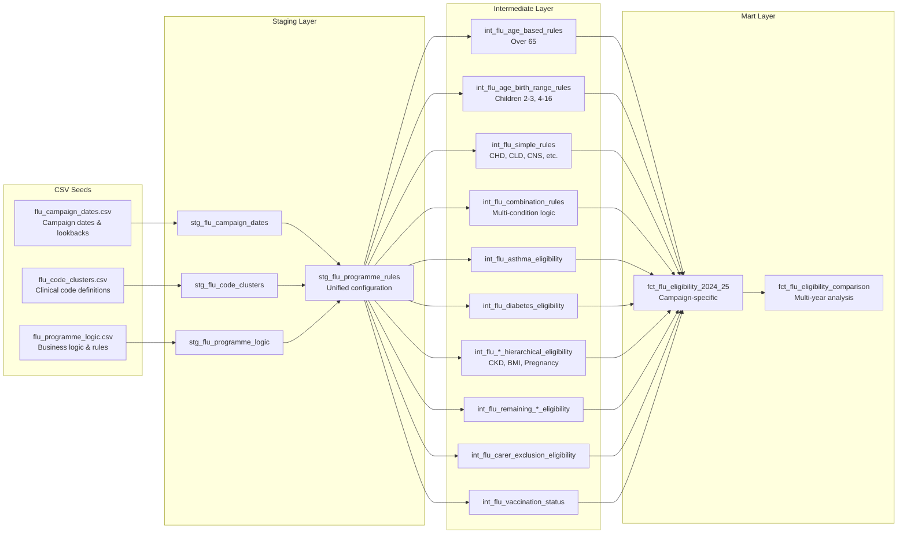

# Flu Programme Rules Configuration

## Overview

The flu vaccination eligibility rules are now managed through CSV seed files rather than complex SQL. This approach makes it much easier to:

- Add new flu campaigns (2025-26, 2026-27, etc.)
- Modify business rules when UKHSA updates them
- Maintain consistency across multiple years
- Audit and validate rule changes

## Architecture

### New Model-Based Architecture (Recommended)

```
seeds/flu_*.csv → staging models → intermediate models → fact models
                       ↓              ↓                  ↓
                stg_flu_*_rules → int_flu_*_rules → fct_flu_eligibility_YYYY_YY

Detailed Flow:
flu_campaign_dates.csv → stg_flu_campaign_dates ┐
flu_code_clusters.csv → stg_flu_code_clusters   ├→ stg_flu_programme_rules → intermediate models
flu_programme_logic.csv → stg_flu_programme_logic┘
```

### Legacy Macro-Based Architecture  

```
seeds/flu_*.csv → stg_flu_programme_rules → apply_flu_rule() macro → fct_flu_eligibility_YYYY_YY
```

**Note**: The new architecture provides better separation of concerns, improved testability, and easier maintenance.

### Three-File CSV Structure

The system uses three separate CSV files for better separation of concerns:

1. **`flu_code_clusters.csv`** - Clinical code cluster definitions
2. **`flu_campaign_dates.csv`** - Campaign-specific dates and lookback periods
3. **`flu_programme_logic.csv`** - Business logic and rule types

## Adding a New Campaign Year

### Step 1: Update `flu_campaign_dates.csv`

To add flu campaign 2025-26:

1. Open `seeds/flu_campaign_dates.csv`
2. Copy all rows where `campaign_id = 'flu_2024_25'`
3. Paste them and change the campaign_id to `flu_2025_26`
4. Update the campaign-specific dates:
   - `start_dat`: 2025-09-01
   - `ref_dat`: 2026-03-31  
   - `child_dat`: 2025-08-31
   - `audit_end_dat`: 2026-02-28
   - Update lookback dates by one year (e.g., 2023-09-01 → 2024-09-01)
   - Update birth ranges by one year for child groups

### Step 2: Update `flu_programme_logic.csv`

1. Copy all rows where `campaign_id = 'flu_2024_25'`
2. Change the campaign_id to `flu_2025_26`
3. Review business logic for any year-specific changes

### Step 3: Verify `flu_code_clusters.csv`

Usually no changes needed - code clusters are reused across campaigns unless UKHSA updates clinical codes.

### Step 4: Create new fact table

Copy `models/marts/programme/flu/fct_flu_eligibility_2024_25.sql` to `fct_flu_eligibility_2025_26.sql` and update:

```sql

```

That's it! The macro system will automatically read the new rules from the CSV.

## Example: Adding 2025-26 Campaign

### Campaign Dates Example (`flu_campaign_dates.csv`):

```csv
campaign_id,rule_group_id,date_type,date_value,description
flu_2025_26,ALL,start_dat,2025-09-01,Campaign start date
flu_2025_26,ALL,ref_dat,2026-03-31,Campaign reference date
flu_2025_26,ALL,child_dat,2025-08-31,Child reference date
flu_2025_26,ALL,audit_end_dat,2026-02-28,Campaign end date
flu_2025_26,AST_GROUP,latest_since_date,2024-09-01,Asthma medication lookback (shifted +1 year)
flu_2025_26,CHILD_2_3,birth_start,2021-09-01,2-3 year olds birth range start (shifted +1 year)
flu_2025_26,CHILD_2_3,birth_end,2023-08-31,2-3 year olds birth range end (shifted +1 year)
```

### Programme Logic Example (`flu_programme_logic.csv`):

```csv
campaign_id,rule_group_id,rule_group_name,rule_type,logic_expression,exclusion_groups,age_min_months,age_max_years,business_description
flu_2025_26,AST_GROUP,Asthma,COMBINATION,AST_COD AND (ASTMED_COD OR ASTRX_COD),,6,65,People with asthma who have used inhalers since Sept 2024
flu_2025_26,OVER65_GROUP,Over 65,AGE_BASED,,,780,,Everyone aged 65 and over at end of March 2026
```

## Benefits of Three-File CSV Approach

### Separation of Concerns
- **Code clusters**: Reusable across campaigns, updated only when UKHSA changes clinical codes
- **Dates**: Campaign-specific, easily updated annually
- **Logic**: Business rules that may evolve with policy changes

### Easy Maintenance
- Business analysts can edit rules directly in Excel
- No SQL knowledge required for rule changes
- Clear, auditable change history in git
- Targeted updates to specific aspects (dates vs logic vs codes)

### Multi-Year Support  
- Easily compare rules across campaign years
- Historical data remains consistent
- Future campaigns can be prepared in advance
- Code definitions stable across years

### Validation
- dbt tests ensure data quality
- Schema validation prevents errors
- Unique combination tests prevent duplicates

## Rule Types Supported

The `flu_programme_logic.csv` supports all UKHSA business rule patterns:

- **SIMPLE**: Single cluster (e.g., CHD_GROUP, LEARNDIS_GROUP)
- **COMBINATION**: Multiple clusters with AND/OR logic (e.g., AST_GROUP, RESP_GROUP)  
- **HIERARCHICAL**: Complex multi-step logic (e.g., CKD_GROUP, BMI_GROUP, PREG_GROUP)
- **EXCLUSION**: Latest code determines inclusion (e.g., DIAB_GROUP, CARER_GROUP)
- **AGE_BASED**: Age thresholds (e.g., OVER65_GROUP)
- **AGE_BIRTH_RANGE**: Birth date ranges (e.g., CHILD_2_3, CHILD_4_16)

Clinical code clusters are defined separately in `flu_code_clusters.csv` with date qualifiers:

- **EARLIEST**: First occurrence of code
- **LATEST**: Most recent occurrence  
- **LATEST_SINCE**: Most recent since specified date
- **LATEST_AFTER**: Most recent after specified date

## Data Flow Diagram



## Editing Rules

Common rule modifications:

### Add new cluster to existing rule
Add a new row to `flu_code_clusters.csv` with the same `rule_group_id` but different `cluster_id`

### Change age restrictions
Modify `age_min_months` or `age_max_years` columns in `flu_programme_logic.csv`

### Update lookback periods
Change date values in `flu_campaign_dates.csv` for LATEST_SINCE rules

### Modify logic expressions
Update the `logic_expression` column in `flu_programme_logic.csv`

### Add exclusions
Update the `exclusion_groups` column in `flu_programme_logic.csv` with pipe-separated rule group IDs

### Update clinical codes
Modify cluster definitions in `flu_code_clusters.csv` when UKHSA releases new code sets

## Testing

After making changes:

```bash
# Reload all flu seed files
dbt seed --select flu_code_clusters flu_campaign_dates flu_programme_logic

# Run all staging models
dbt run --select stg_flu_campaign_dates stg_flu_code_clusters stg_flu_programme_logic stg_flu_programme_rules

# Test configuration
dbt test --select stg_flu_programme_rules

# Run intermediate models
dbt run --select tag:flu_intermediate

# Test a specific campaign fact table
dbt run --select fct_flu_eligibility_2024_25
dbt test --select fct_flu_eligibility_2024_25
```

This validates the new configuration before using it in fact tables.

## New Model-Based Implementation

The refactored system replaces complex macros with clear dbt model hierarchy:

### Model Structure

```
models/
├── staging/
│   ├── stg_flu_campaign_dates.sql              # Transforms seed: flu_campaign_dates.csv
│   ├── stg_flu_code_clusters.sql               # Transforms seed: flu_code_clusters.csv
│   ├── stg_flu_programme_logic.sql             # Transforms seed: flu_programme_logic.csv
│   ├── stg_flu_programme_rules.sql             # Unified configuration view (joins all staging)
│   └── stg_codesets_ukhsa_flu_latest.sql       # UKHSA flu codeset mappings
├── intermediate/programme/flu/
│   ├── int_flu_age_based_rules.sql             # Age threshold eligibility (Over 65)
│   ├── int_flu_age_birth_range_rules.sql       # Child age groups (2-3, 4-16)
│   ├── int_flu_simple_rules.sql                # Single condition rules (CHD, CLD, etc.)
│   ├── int_flu_combination_rules.sql           # Multi-condition AND/OR logic
│   ├── int_flu_asthma_eligibility.sql          # Specific asthma combination logic
│   ├── int_flu_diabetes_eligibility.sql        # Diabetes with exclusion logic
│   ├── int_flu_ckd_hierarchical_eligibility.sql     # CKD staging hierarchy
│   ├── int_flu_bmi_hierarchical_eligibility.sql     # BMI/obesity hierarchy
│   ├── int_flu_pregnancy_hierarchical_eligibility.sql # Pregnancy hierarchy
│   ├── int_flu_remaining_simple_eligibility.sql     # Other simple rules (CNS, ASPLENIA, LEARNDIS)
│   ├── int_flu_remaining_combination_eligibility.sql # Other combinations (IMMUNO, RESP)
│   ├── int_flu_carer_exclusion_eligibility.sql      # Carer with exclusion logic
│   └── int_flu_vaccination_status.sql          # Vaccination tracking
└── marts/programme/flu/
    ├── fct_flu_eligibility_2024_25.sql         # Campaign-specific fact table
    ├── fct_flu_eligibility_TEMPLATE.sql        # Template for new campaigns
    └── fct_flu_eligibility_comparison.sql      # Multi-year comparison
```

### Benefits of New Architecture

- **Separation of concerns**: Each model handles one responsibility
- **Testable**: Each rule can be tested independently
- **Maintainable**: Business logic in SQL models, not complex macros
- **Debuggable**: Clear data lineage through dbt DAG
- **Scalable**: Easy to add new rule groups or campaigns
- **Follows dbt best practices**: Models over macros for business logic

### Migration Path

1. **Phase 1**: Use new staging models (✅ Complete)
2. **Phase 2**: Build intermediate rule models (✅ Complete)  
3. **Phase 3**: Create unified fact model (✅ Complete)
4. **Phase 4**: Smart parameter system (✅ Complete)
5. **Phase 5**: Dynamic cluster queries (✅ Complete)
6. **Phase 6**: Template-based campaign models (✅ Complete)

### Implementation Notes

#### Macro Configuration Approach
The `flu_campaign_utils.sql` macro currently contains hardcoded configuration for the flu_2024_25 campaign. This is a temporary solution to avoid unsafe introspection issues while maintaining the ability to reference cluster and date configurations dynamically.

**Why hardcoded?** DBT's introspection capabilities were causing warnings when trying to dynamically query seed data at compile time. The hardcoded approach ensures stable compilation while still providing the benefits of centralized configuration.

**Future improvement:** When DBT provides better support for compile-time seed data access, this can be refactored to dynamically read from the seed files.

#### Model Dependencies
The intermediate models use several utility macros:
- `get_flu_clusters_for_rule_group()` - Returns cluster IDs for a rule group
- `get_flu_campaign_date()` - Returns campaign-specific dates
- `get_flu_audit_date()` - Returns the audit end date
- `get_flu_observations_for_rule_group()` - Fetches observations for a rule group
- `get_flu_medications_for_rule_group()` - Fetches medications for a rule group

### Campaign Setup Workflow

**For detailed instructions, see [Flu Campaign Setup Guide](docs/flu_campaign_setup_guide.md)**

#### Quick Setup (5 Steps):
1. **Copy CSV data**: Add new campaign_id rows to three seed files
2. **Update dates**: Shift dates +1 year, review business logic  
3. **Copy template**: Create `fct_flu_eligibility_YYYY_YY.sql` from template
4. **Update placeholders**: Replace campaign_id and campaign_name
5. **Test & validate**: Run models and verify results

#### Multi-Year Analysis:
```sql
-- Campaign-specific analysis
SELECT * FROM {{ ref('fct_flu_eligibility_2024_25') }}

-- Multi-year comparison  
SELECT * FROM {{ ref('fct_flu_eligibility_comparison') }}
```

#### Dynamic Development:
```bash
# Switch campaigns via variables
dbt run --vars '{"flu_current_campaign": "flu_2025_26"}'

# Override audit date
dbt run --vars '{"flu_audit_end_date": "2025-02-28"}'
``` 