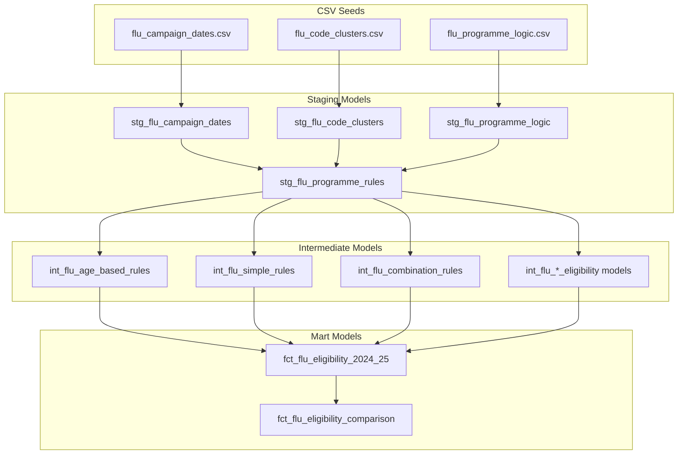

# Flu Campaign Setup Guide

## Overview

This guide explains how to set up a new flu vaccination campaign using the improved model-based architecture. The system is designed to make new campaign setup as simple as copying CSV data and one template file.

## Campaign Architecture

### Data Flow
```
CSV Seeds → Staging Models → Intermediate Models → Campaign-Specific Fact Models
                ↓              ↓                    ↓
         stg_flu_rules → int_flu_rules → fct_flu_eligibility_YYYY_YY
```

### File Structure
```
models/
├── staging/
│   ├── stg_flu_campaign_dates.sql              # Transforms seed: flu_campaign_dates.csv
│   ├── stg_flu_code_clusters.sql               # Transforms seed: flu_code_clusters.csv
│   ├── stg_flu_programme_logic.sql             # Transforms seed: flu_programme_logic.csv
│   ├── stg_flu_programme_rules.sql             # Unified configuration (joins all staging)
│   └── stg_codesets_ukhsa_flu_latest.sql       # UKHSA flu codeset mappings
├── intermediate/programme/flu/
│   ├── int_flu_age_based_rules.sql              # Age threshold (Over 65)
│   ├── int_flu_age_birth_range_rules.sql        # Child age groups (2-3, 4-16)
│   ├── int_flu_simple_rules.sql                 # Single condition rules
│   ├── int_flu_combination_rules.sql            # Multi-condition logic
│   ├── int_flu_asthma_eligibility.sql           # Asthma combination logic
│   ├── int_flu_diabetes_eligibility.sql         # Diabetes exclusion logic
│   ├── int_flu_ckd_hierarchical_eligibility.sql # CKD staging hierarchy
│   ├── int_flu_bmi_hierarchical_eligibility.sql # BMI/obesity hierarchy
│   ├── int_flu_pregnancy_hierarchical_eligibility.sql # Pregnancy hierarchy
│   ├── int_flu_remaining_simple_eligibility.sql # CNS, ASPLENIA, LEARNDIS
│   ├── int_flu_remaining_combination_eligibility.sql # IMMUNO, RESP
│   ├── int_flu_carer_exclusion_eligibility.sql  # Carer exclusion logic
│   └── int_flu_vaccination_status.sql           # Vaccination tracking
├── macros/flu/
│   └── flu_campaign_utils.sql                   # Campaign configuration utilities
└── marts/programme/flu/
    ├── fct_flu_eligibility_2024_25.sql     # Campaign-specific fact
    ├── fct_flu_eligibility_comparison.sql  # Multi-year comparison
    └── fct_flu_eligibility_TEMPLATE.sql    # Template for new campaigns
```

## Setting Up a New Campaign (e.g., 2025-26)

### Step 1: Update CSV Seed Files

#### 1.1 Update `flu_campaign_dates.csv`
Copy all `flu_2024_25` rows and update:
```csv
campaign_id,rule_group_id,date_type,date_value,description
flu_2025_26,ALL,start_dat,2025-09-01,Campaign start date
flu_2025_26,ALL,ref_dat,2026-03-31,Campaign reference date
flu_2025_26,ALL,child_dat,2025-08-31,Child reference date
flu_2025_26,ALL,audit_end_dat,2026-02-28,Campaign end date
flu_2025_26,AST_GROUP,latest_since_date,2024-09-01,Asthma medication lookback (+1 year)
flu_2025_26,IMMUNO_GROUP,latest_since_date,2025-03-01,Immunosuppression lookback (+1 year)
flu_2025_26,CHILD_2_3,birth_start,2021-09-01,2-3 year olds birth start (+1 year)
flu_2025_26,CHILD_2_3,birth_end,2023-08-31,2-3 year olds birth end (+1 year)
flu_2025_26,CHILD_4_16,birth_start,2009-09-01,4-16 year olds birth start (+1 year)
flu_2025_26,CHILD_4_16,birth_end,2021-08-31,4-16 year olds birth end (+1 year)
flu_2025_26,FLUVAX_GROUP,latest_after_date,2025-08-31,Flu vaccination after date (+1 year)
flu_2025_26,LAIV_GROUP,latest_after_date,2025-08-31,LAIV vaccination after date (+1 year)
```

#### 1.2 Update `flu_programme_logic.csv`
Copy all `flu_2024_25` rows and update campaign_id:
```csv
campaign_id,rule_group_id,rule_group_name,rule_type,logic_expression,exclusion_groups,age_min_months,age_max_years,business_description,technical_description
flu_2025_26,AST_GROUP,Asthma,COMBINATION,AST_COD AND (ASTMED_COD OR ASTRX_COD),,6,65,People with asthma who have used inhalers since Sept 2024,Earliest asthma diagnosis + (latest medication since lookback date OR latest admission ever)
flu_2025_26,OVER65_GROUP,Over 65,AGE_BASED,,,780,,Everyone aged 65 and over at end of March 2026,Age >= 65 years at ref_dat
[... copy all other rule groups ...]
```

**Note**: Review business logic for any year-specific changes when UKHSA updates guidance.

#### 1.3 Verify `flu_code_clusters.csv`
Usually no changes needed unless UKHSA releases new clinical code sets.

### Step 2: Create Campaign-Specific Fact Model

#### 2.1 Copy Template
```bash
cp models/marts/programme/flu/fct_flu_eligibility_TEMPLATE.sql \
   models/marts/programme/flu/fct_flu_eligibility_2025_26.sql
```

#### 2.2 Update Template Placeholders
Replace in `fct_flu_eligibility_2025_26.sql`:
- `CAMPAIGN_ID_PLACEHOLDER` → `flu_2025_26`
- `CAMPAIGN_NAME_PLACEHOLDER` → `2025-26 Flu Vaccination Campaign`

### Step 3: Update Comparison Model

Add new campaign to `fct_flu_eligibility_comparison.sql`:
```sql
-- Add after existing UNION clauses
UNION ALL
SELECT 
    campaign_id,
    campaign_name,
    -- ... all other columns ...
    'upcoming' AS campaign_period
FROM {{ ref('fct_flu_eligibility_2025_26') }}
```

### Step 4: Update Configuration

#### 4.1 Update `dbt_project.yml`
```yaml
vars:
  flu_current_campaign: "flu_2025_26"     # Update to new campaign
  flu_previous_campaign: "flu_2024_25"    # Update to previous
  flu_audit_end_date: "CURRENT_DATE"      # Or specific date
```

### Step 5: Test and Validate

#### 5.1 Run Seeds and Models
```bash
# Reload seed data
dbt seed --select flu_code_clusters flu_campaign_dates flu_programme_logic

# Run all staging models
dbt run --select stg_flu_campaign_dates stg_flu_code_clusters stg_flu_programme_logic stg_flu_programme_rules

# Test staging data quality
dbt test --select stg_flu_programme_rules

# Run all intermediate models at once (easier than listing each one)
dbt run --select models/intermediate/programme/flu

# Run campaign-specific fact model
dbt run --select fct_flu_eligibility_2025_26

# Test fact model
dbt test --select fct_flu_eligibility_2025_26

# Run comparison model
dbt run --select fct_flu_eligibility_comparison
```

#### 5.2 Validation Queries
```sql
-- Check campaign has data
SELECT campaign_id, COUNT(*) as eligible_people
FROM {{ ref('fct_flu_eligibility_2025_26') }}
GROUP BY campaign_id;

-- Compare with previous year
SELECT 
    campaign_id,
    rule_group_id,
    COUNT(*) as eligible_people
FROM {{ ref('fct_flu_eligibility_comparison') }}
GROUP BY campaign_id, rule_group_id
ORDER BY rule_group_id, campaign_id;

-- Check for expected rule groups
SELECT DISTINCT rule_group_id
FROM {{ ref('fct_flu_eligibility_2025_26') }}
ORDER BY rule_group_id;
```

## Campaign Switching

### For Analysis
Use campaign-specific models directly:
```sql
-- Current campaign analysis
SELECT * FROM {{ ref('fct_flu_eligibility_2025_26') }}

-- Previous campaign analysis  
SELECT * FROM {{ ref('fct_flu_eligibility_2024_25') }}

-- Multi-year comparison
SELECT * FROM {{ ref('fct_flu_eligibility_comparison') }}
```

### For Development/Testing
Use variables to switch context:
```bash
# Run with specific campaign
dbt run --vars '{"flu_current_campaign": "flu_2024_25"}'

# Run with specific audit date
dbt run --vars '{"flu_audit_end_date": "2025-02-28"}'

# Run comparison between specific campaigns
dbt run --vars '{"flu_current_campaign": "flu_2025_26", "flu_previous_campaign": "flu_2024_25"}'
```

## Benefits of This Approach

### ✅ Easy Maintenance
- Copy CSV rows and update dates (+1 year)
- Copy one template file and update 2 placeholders
- No complex SQL modification required

### ✅ Analyst-Friendly
- Simple model references: `{{ ref('fct_flu_eligibility_2025_26') }}`
- Stable historical models
- Clear data lineage

### ✅ Multi-Year Analysis
- Union campaign-specific models for comparison
- Historical preservation of each campaign's logic
- Easy trend analysis

### ✅ Flexible Configuration
- All business logic driven by CSV configuration
- Variables for dynamic development/testing
- Easy rule changes when UKHSA updates guidance

## Troubleshooting

### Common Issues

1. **Missing Campaign Data**: Ensure all three CSV files have the new campaign_id
2. **Date Format Errors**: Use YYYY-MM-DD format in CSV dates  
3. **Variable Errors**: Ensure `flu_current_campaign` matches CSV campaign_id
4. **Missing Rule Groups**: Check that business logic was copied correctly
5. **Macro Configuration**: The `flu_campaign_utils.sql` macro needs to be updated with new campaign configuration

### Validation Checklist

- [ ] All CSV files updated with new campaign_id
- [ ] Dates shifted correctly (+1 year for most fields)
- [ ] Campaign-specific fact model created from template
- [ ] Template placeholders replaced correctly
- [ ] Comparison model updated to include new campaign
- [ ] Variables in dbt_project.yml updated
- [ ] Macro configuration updated in `flu_campaign_utils.sql` (if adding new campaign)
- [ ] Models run successfully without errors
- [ ] Expected rule groups present in output
- [ ] Row counts reasonable compared to previous year

## Model Dependencies Diagram



## Important Implementation Notes

### Macro Configuration
The `flu_campaign_utils.sql` macro contains hardcoded configuration for campaigns. This is a temporary approach to avoid unsafe introspection warnings in dbt. When adding a new campaign:

1. Add the new campaign configuration to the macro
2. Include cluster mappings, dates, and rule configurations
3. This ensures stable compilation and consistent behavior

### Template Usage
The template file uses a hardcoded campaign_id that needs to be replaced. When copying the template:
1. Replace the campaign_id value in the `set` statement
2. Update the campaign_name in the CTE
3. Ensure all references use the new campaign_id